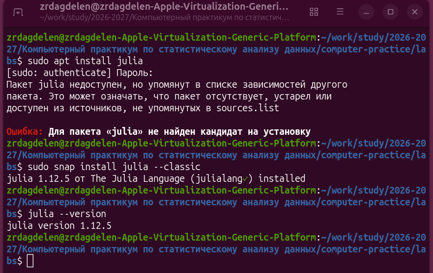
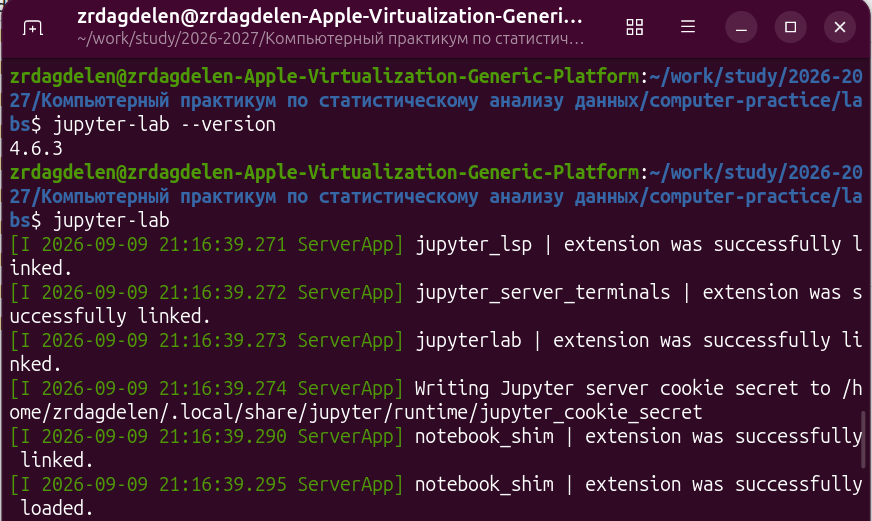
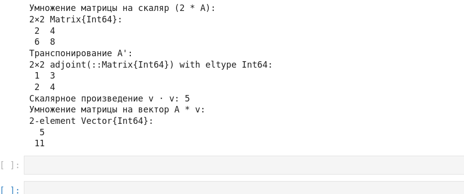

---
## Author
author:
  name: Дагделен Зейнап Реджеповна
  email: 1132236052@pfur.ru
  affiliation:
    - name: Российский университет дружбы народов
      country: Российская Федерация
      city: Москва
      address: ул. Орджоникидзе
## Title
title: "Отчет по лабораторной работе №1"
subtitle: "Компьютерный практикум по статистическому анализу данных"
license: CC BY
date: today
date-format: "YYYY-MM-DD"
---

# Информация

## Докладчик

:::::::::::::: {.columns align=center}
::: {.column width="70%"}

  * Дагделен Зейнап Реджеповна
  * студентка Российского университета дружбы народов
  * [1132236052@pfur.ru](mailto:1132236052@pfur.ru)
  * г. Москва, ул. Орджоникидзе

:::
::: {.column width="50%"}

{width=60%}

:::
::::::::::::::

# Вводная часть

## Актуальность

- Julia — современный инструмент для научных вычислений и статистического анализа данных
- Необходимо подготовить рабочее пространство и инструментарий
- Важно познакомиться с основами синтаксиса языка на простейших примерах

## Объект и предмет исследования

- Объект: среда выполнения кода Julia (Jupyter Lab, REPL)
- Предмет: базовые синтаксические конструкции языка Julia и работа с пакетами

## Цели и задачи

- Цель:
    - Подготовить рабочее пространство и инструментарий для работы с языком программирования Julia, познакомиться с основами синтаксиса Julia на простейших примерах.
- Задачи:
    - Установить Julia, Jupyter Lab и пакет IJulia.
    - Запустить Jupyter Lab и создать новый ноутбук с ядром Julia.
    - Выполнить примеры из раздела 1.3.3 методических указаний.
    - Самостоятельно выполнить задания 1–4 по вводу/выводу, парсингу, математическим операциям и операциям с матрицами.

# Выполнение лабораторной работы

## Настройка среды: установка Julia

- Julia успешно установлена через snap и после установки проверена версия Julia

{#fig-001 width=55%}

## Установка IJulia

- Запущена интерактивная оболочка Julia (julia). В ней выполнена установка пакета IJulia через Pkg

{#fig-002 width=55%}

## Запуск Jupyter Lab

{#fig-004 width=55%}

## Интерфейс Jupyter Lab

{#fig-005 width=55%}

## Выполнение примеров (раздел 1.3.3)

{#fig-006 width=55%}

## Задание 1. Функции ввода/вывода

{#fig-007 width=35%}

## Задание 2. Функция parse()

{#fig-008 width=55%}

## Задание 3. Математические операции

{#fig-009 width=35%}

## Задание 4. Матрицы и векторы (часть 1)

{#fig-010 width=35%}

## Задание 4. Матрицы и векторы (часть 2)

{#fig-011 width=55%}

# Результаты

## Основные результаты

- Установлены Julia (версия 1.12.5) и Jupyter Lab (версия 4.6.3)
- Установлен пакет IJulia для работы Julia в Jupyter
- В Jupyter Lab создан ноутбук с ядром Julia
- Успешно выполнены все примеры и задания
- Получены корректные результаты вычислений, включая работу с матрицами и векторами

# Заключение

## Главный вывод

В ходе лабораторной работы были выполнены все поставленные задачи. Цель работы достигнута. В дальнейшем планируется изучение более сложных пакетов Julia для статистического анализа и визуализации данных.

