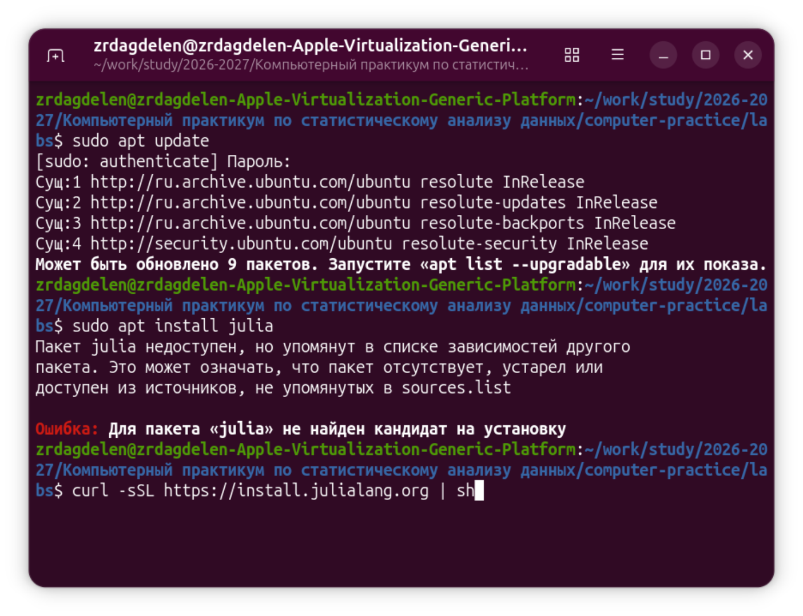
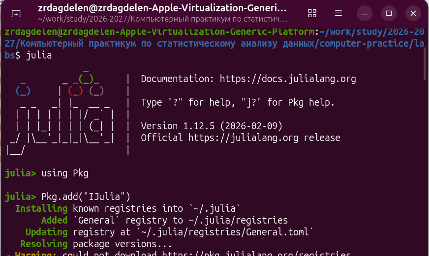
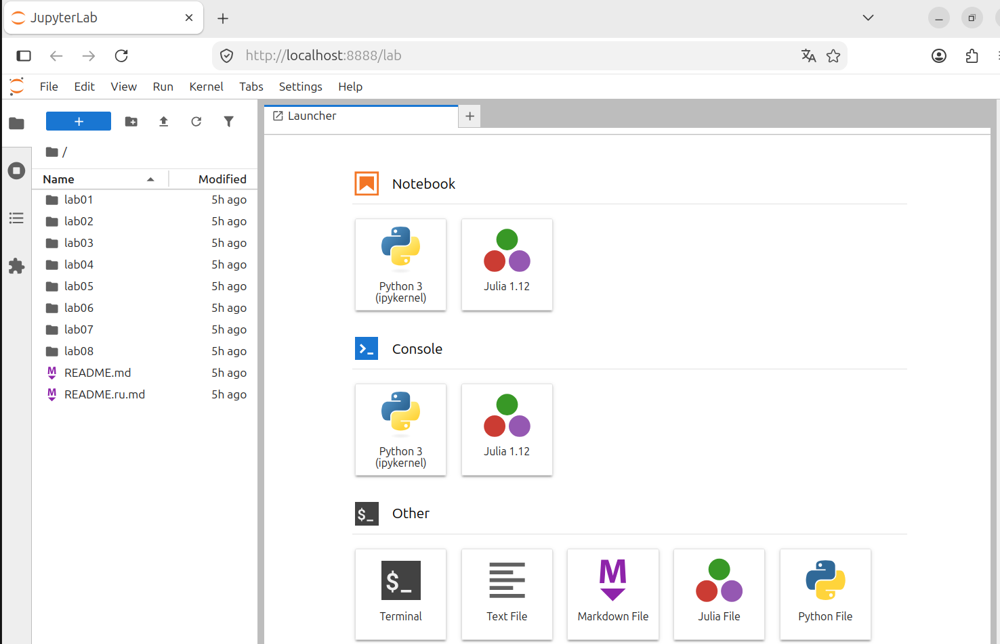
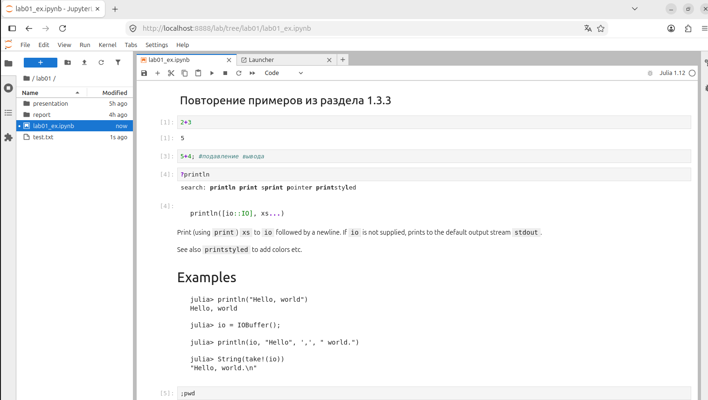
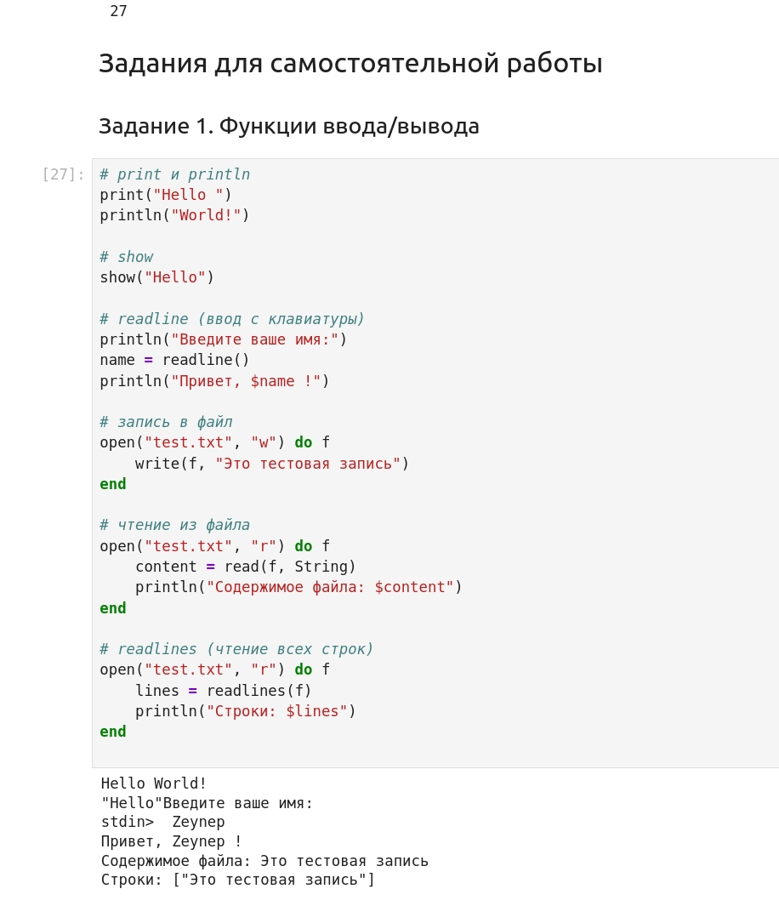
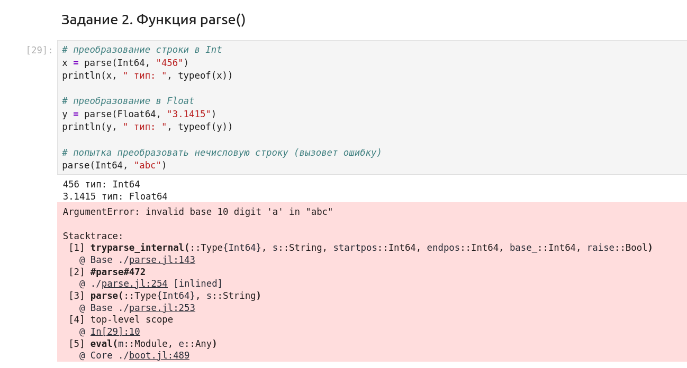
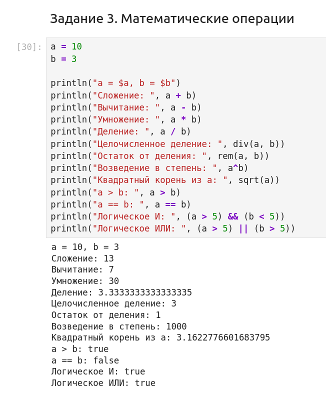
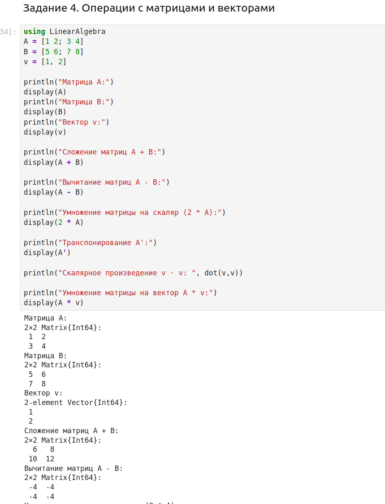

---
## Author
author:
  name: Дагделен Зейнап Реджеповна
  email: 1132236052@pfur.ru
  affiliation:
    - name: Российский университет дружбы народов
      country: Российская Федерация
      city: Москва
      address: ул. Орджоникидзе

## Title
title: "Отчет по лабораторной работе №1"
subtitle: "Компьютерный практикум по статистическому анализу данных"
license: "CC BY"
abstract: |
  В данном отчёте представлены результаты выполнения первой лабораторной работы по теме «Установка и настройка Julia. Основные принципы».
  Описаны использованные методы, полученные экспериментальные данные и их анализ.
  Сделаны выводы о достижении поставленной цели.
keywords: [лабораторная работа, Julia, Jupyter, Markdown]
---

# Введение

## Актуальность

Данная работа актуальна в рамках освоения языка Julia как современного инструмента для научных вычислений и статистического анализа данных.

## Цель работы

Основная цель работы — подготовить рабочее пространство и инструментарий для работы с языком программирования Julia, на простейших примерах познакомиться с основами синтаксиса Julia.

## Задачи

1. Установить Julia с помощью пакетного менеджера.  
2. Установить Jupyter Lab и пакет IJulia.  
3. Запустить Jupyter Lab и создать новый ноутбук с ядром Julia.  
4. Выполнить примеры из раздела 1.3.3 методических указаний.  
5. Самостоятельно выполнить задания 1–4 по вводу/выводу, парсингу, математическим операциям и операциям с матрицами.

## Объект и предмет исследования

Объект: среда выполнения кода Julia (Jupyter Lab, REPL).  
Предмет: базовые синтаксические конструкции языка Julia и работа с пакетами.

## Методы исследования

В работе использованы следующие методы:

- анализ документации языка Julia и Jupyter;
- установка программного обеспечения с помощью менеджеров пакетов (snap, Pkg);
- экспериментальное выполнение программного кода в интерактивной среде Jupyter Lab;

# Теоретическая часть

Julia — высокоуровневый язык программирования с динамической типизацией, разработанный для научных вычислений [@julia_doc]. Он сочетает скорость выполнения, близкую к C, и простоту синтаксиса, как у Python или MATLAB.

Работа с командной строкой и пакетными менеджерами подробно описана в литературе [@newham_book_learning-bash_en; @robbins_book_bash_en; @zarrelli_book_mastering-bash_en].

Ключевые особенности:

- Компиляция JIT (Just-In-Time) на основе LLVM.  
- Встроенная поддержка многопоточности и распределённых вычислений.  
- Богатая экосистема пакетов (DataFrames, Plots, LinearAlgebra, StatsBase и др.).  
- Возможность работы в Jupyter через ядро IJulia [@ijulia_github].

Для управления пакетами используется встроенный менеджер Pkg. Установка пакета выполняется командой Pkg.add("ИмяПакета").

Jupyter Lab — интерактивная веб-среда для работы с ноутбуками, поддерживающая множество языков (Python, Julia, R и др.) [@jupyterlab_doc].

# Материалы и методы

Оборудование:

- Виртуальная машина на базе Apple Virtualization (Ubuntu Linux).

Программное обеспечение:

- ОС: Ubuntu (версия Resolute).  
- Пакетные менеджеры: apt, snap.  
- Интерпретатор Julia версии 1.12.5.  
- Jupyter Lab версии 4.6.3.  
- Браузер для доступа к Jupyter Lab.

Использование операционной системы Linux и её стандартных утилит рассматривается в [@tanenbaum_book_modern-os_ru].

Методы:

- Установка Julia через snap.  
- Установка IJulia через встроенный менеджер пакетов Julia Pkg.  
- Запуск Jupyter Lab из терминала.  
- Выполнение кода в ячейках ноутбука.

# Выполнение лабораторной работы

## Настройка среды

Первоначально была предпринята попытка установить Julia через apt, но пакет не был найден в репозиториях (рис. -@fig-001).

{#fig-001 width=70%}

Затем Julia была успешно установлена через snap и после установки проверена версия(рис. -@fig-002):

{#fig-002 width=70%}

Запущена интерактивная оболочка Julia (julia). В ней выполнены команды(рис. -@fig-003):

{#fig-003 width=70%}

Проверена версия Jupyter Lab и затем выполнен запуск (рис. -@fig-004). В терминале отобразились логи успешной загрузки расширений.

{#fig-004 width=70%}

После запуска в браузере открылся интерфейс Jupyter Lab. В панели Launcher доступны ядра Python 3 и Julia 1.12. (рис. -@fig-005)

{#fig-005 width=70%}

Создан новый ноутбук с ядром Julia.

## Выполнение примеров (раздел 1.3.3)

В ноутбуке выполнены примеры (рис. -@fig-006):

- Арифметические операции (2+3).  
- Подавление вывода с помощью ;.  
- Справка по функции println.  
- Команда ;pwd для вывода текущей директории и тд.

{#fig-006 width=70%}

## Выполнение заданий

### Задание 1. Функции ввода/вывода

Выполнен код, демонстрирующий (рис. -@fig-007):

- print, println, show;  
- ввод с клавиатуры через readline;  
- запись и чтение файлов (write, read, readlines).

Вывод программы показывает корректное выполнение всех операций.

{#fig-007 width=70%}

### Задание 2. Функция parse()

Продемонстрировано (рис. -@fig-008):

- преобразование строки в Int64;  
- преобразование в Float64;  
- генерация ошибки при попытке парсинга нечисловой строки.

{#fig-008 width=70%}

### Задание 3. Математические операции

С переменными a=10 и b=3 выполнены:

- арифметические операции (+, -, *, /, div, rem, ^);  
- вычисление квадратного корня sqrt;  
- сравнения и логические операции.

Все результаты выведены на экран (рис. -@fig-009).

{#fig-009 width=70%}

### Задание 4. Операции с матрицами и векторами

Подключён пакет LinearAlgebra. Созданы матрицы A, B и вектор v. Выполнены:

- сложение и вычитание матриц;  
- умножение на скаляр;  
- транспонирование (A');  
- скалярное произведение (dot);  
- умножение матрицы на вектор (рис. -@fig-010), (рис. -@fig-011).

Результаты корректно отображены.

{#fig-010 width=70%}

{#fig-011 width=70%}

# Результаты

- Установлены Julia (версия 1.12.5) и Jupyter Lab (версия 4.6.3).  
- Установлен пакет IJulia для работы Julia в Jupyter.  
- В Jupyter Lab создан ноутбук с ядром Julia.  
- Успешно выполнены все примеры и задания.  
- Получены корректные результаты вычислений, включая работу с матрицами и векторами.  
- Все скриншоты зафиксированы и приложены к отчёту.

# Обсуждение результатов

Все задания выполнены без ошибок. Установка через snap оказалась удобным решением, так как пакет julia отсутствовал в стандартных репозиториях apt. Пакет IJulia установился без проблем и корректно зарегистрировался как ядро для Jupyter.

# Заключение

В ходе лабораторной работы были выполнены все поставленные задачи.

Цель работы достигнута. В дальнейшем планируется изучение более сложных пакетов Julia для статистического анализа и визуализации данных.

# Список литературы {.unnumbered}

::: {#refs}
:::

